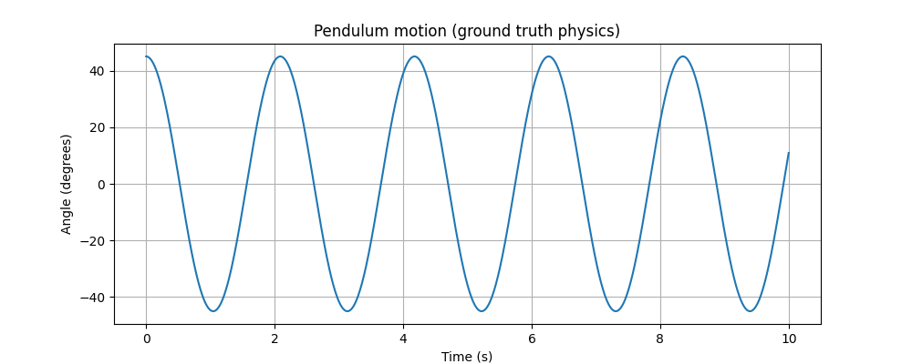
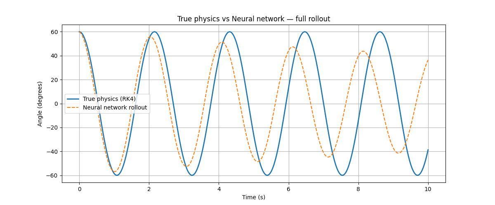

# Pendulum Neural Dynamics

Can a neural network learn the physics of a pendulum just from data — without ever being told the underlying equations?

This project trains a small feedforward neural network to predict the next state `(angle, angular velocity)` of a simple pendulum, given only the current state. No physics equations are given to the network — it only ever sees numerical state pairs generated from a real physics simulation (RK4 integration of the pendulum's equation of motion).

## What I built

1. **Ground truth simulator** — a pendulum simulated using RK4 numerical integration (no ML, pure physics).
2. **Training data** — ~200,000 state transitions generated from 200 random pendulum trajectories.
3. **Neural network** — a small feedforward net (2 hidden layers, 64 units, Tanh activation) trained to predict the next state from the current one.
4. **Rollout test** — after training, the network's own predictions are fed back into itself repeatedly to generate a full trajectory, then compared against the true physics on a starting condition it never saw during training.

## Ground truth pendulum motion

## True physics vs. neural network rollout

## What I found

The network predicts single steps almost perfectly (training loss ~1e-6). But when its own predictions are fed back into itself for hundreds of steps, small errors compound — the pendulum's swing visibly loses amplitude and drifts out of phase over time, something a real frictionless pendulum never does.

This happens because the network only learned the *local* shape of the dynamics from data — it has no built-in notion of energy conservation, so nothing forces it to preserve the pendulum's swing height indefinitely. The true physics simulator, by contrast, is derived from the governing equation itself and doesn't have this problem.

This is a small, concrete illustration of the gap between a **statistical approximation of a physical law** and **the law itself** — and it's the direction I want to keep exploring: where machine learning and physics agree, and where they don't.

## Tech used
Python, PyTorch, NumPy, Matplotlib — trained and run in Google Colab (CPU only).

## Next steps
Possible directions: measuring energy drift quantitatively, or trying a Hamiltonian Neural Network that bakes in conservation laws explicitly.
